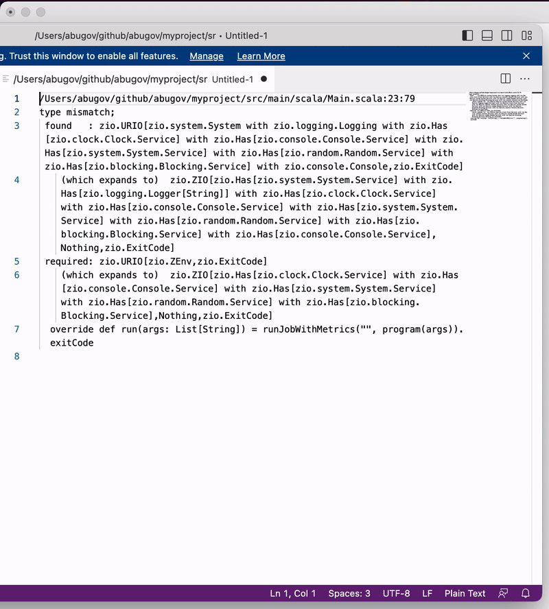

### Usage



### Build & Run
```
sbt assembly
cp target/scala-2.13/ziodiff.jar /usr/local/bin/

sudo cp target/scala-2.13/ziodiff.jar /usr/local/bin/
alias ziodiff='pbpaste | java -jar /usr/local/bin/ziodiff.jar'
```

### Test
```
copy to clipboard:

/Users/abugov/github/abugov/unit-finance/modules/jobs/src/unit/jobs/VisaEndOfDayJob.scala:23:79
type mismatch;
found   : zio.URIO[zio.system.System with zio.logging.Logging with zio.Has[zio.clock.Clock.Service] with zio.Has[zio.console.Console.Service] with zio.Has[zio.system.System.Service] with zio.Has[zio.random.Random.Service] with zio.Has[zio.blocking.Blocking.Service] with zio.console.Console,zio.ExitCode]
(which expands to)  zio.ZIO[zio.Has[zio.system.System.Service] with zio.Has[zio.logging.Logger[String]] with zio.Has[zio.clock.Clock.Service] with zio.Has[zio.console.Console.Service] with zio.Has[zio.system.System.Service] with zio.Has[zio.random.Random.Service] with zio.Has[zio.blocking.Blocking.Service] with zio.Has[zio.console.Console.Service],Nothing,zio.ExitCode]
required: zio.URIO[zio.ZEnv,zio.ExitCode]
(which expands to)  zio.ZIO[zio.Has[zio.clock.Clock.Service] with zio.Has[zio.console.Console.Service] with zio.Has[zio.system.System.Service] with zio.Has[zio.random.Random.Service] with zio.Has[zio.blocking.Blocking.Service],Nothing,zio.ExitCode]
override def run(args: List[String]) = runJobWithMetrics("", program(args)).exitCode

run:
ziodiff
```